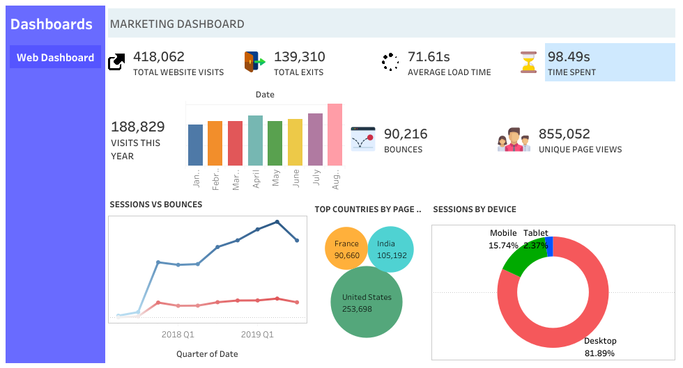

#  Web Marketing Dashboard  

This project is a **Tableau dashboard** that analyzes website performance metrics, focusing on **traffic, engagement, and user behavior**. The dashboard is designed to provide clear insights into how visitors interact with a website, where they come from, and what devices they use.  

 **Live Demo:** [View Dashboard on Tableau Public](https://public.tableau.com/shared/8MN5SD5KK?:display_count=n&:origin=viz_share_link)  
---

---

##  Key Insights  

- **Traffic Overview**  
  - 418,062 total website visits  
  - 188,829 visits recorded this year  

- **Engagement Metrics**  
  - 139,310 exits, 90,216 bounces  
  - Average load time: 71.6s  
  - Average session duration: 98.5s  

- **Geographic Breakdown**  
  - United States: 253,698 visits  
  - India: 105,192 visits  
  - France: 90,660 visits  

- **Device Usage**  
  - Desktop: 81.89%  
  - Mobile: 15.74%  
  - Tablet: 2.37%  

- **Trend Analysis**  
  - Sessions vs. Bounces tracked over time  
  - Seasonal trends visualized across quarters  

---

